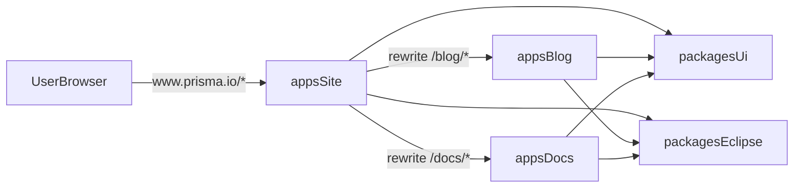

# Multi-Zone Architecture Overview

This repository is a pnpm monorepo with three closely related Next.js apps:

- `apps/site`: the main Prisma website and the public multi-zone entrypoint
- `apps/blog`: the blog zone
- `apps/docs`: the docs zone

At a high level, users experience docs and blog content as `www.prisma.io/docs/*` and `www.prisma.io/blog/*`, but those paths are served by separate Next.js apps behind the scenes.

## Two Layers

There are two architectural layers to keep in mind:

1. The monorepo layer decides how code is organized, shared, built, and run.
2. The runtime layer decides which app answers a given request.

The monorepo layer is defined by `pnpm-workspace.yaml`, the root `package.json`, and `turbo.json`.

- `pnpm-workspace.yaml` includes `apps/*` and `packages/*`, so all apps and shared packages live in one workspace.
- The root `package.json` delegates common workflows to Turbo with `pnpm build`, `pnpm dev`, `pnpm check`, and `pnpm types:check`.
- `turbo.json` defines the task graph, shared cache inputs, and build outputs for `.next`, `dist`, and cache folders.

This matches the useful Turborepo framing for this repo: package boundaries are managed at the workspace level, while runtime composition happens inside the app configs rather than through root scripts.

## Shared Packages

All three apps rely on shared workspace packages:

- `packages/ui` (`@prisma-docs/ui`): shared navigation, footer, theming, and UI helpers
- `packages/eclipse` (`@prisma/eclipse`): shared design system components and styles

That means the apps are separate deployable zones, but they still present a mostly unified UI by consuming the same package-level building blocks.

## App Roles

| App | Local port | Runtime role | Key routing config |
|------|------|------|------|
| `apps/site` | `3000` | Main website host and multi-zone entrypoint | `assetPrefix: "/site-static"` and cross-zone `rewrites()` |
| `apps/docs` | `3001` | Standalone docs zone | `basePath: "/docs"` and `assetPrefix: "/docs-static"` |
| `apps/blog` | `3002` | Standalone blog zone | `basePath: "/blog"` and `assetPrefix: "/blog-static"` |

## `apps/site`

`apps/site` is the root host zone. Its own `README.md` describes it as the "Primary host app for the multi-zone Next.js setup."

Important characteristics:

- It runs on port `3000`.
- It does not use a `basePath`.
- It serves its own static assets from `/site-static`.
- It owns the cross-zone rewrites that make docs and blog look like subpaths of the main site.
- It also contains a large `redirects()` table for legacy Prisma routes and hostnames.

The most important part of the multi-zone setup lives in `apps/site/next.config.mjs`:

```758:790:apps/site/next.config.mjs
        // Proxy canonical docs path to docs infrastructure
        {
          source: "/docs",
          destination: `${DOCS_ORIGIN}/docs`,
          missing: [{ type: "host", value: DOCS_ORIGIN_HOST }],
        },
        {
          source: "/docs/:any*",
          destination: `${DOCS_ORIGIN}/docs/:any*`,
          missing: [{ type: "host", value: DOCS_ORIGIN_HOST }],
        },
        {
          source: "/docs-static/:path*",
          destination: `${DOCS_ORIGIN}/docs-static/:path*`,
          missing: [{ type: "host", value: DOCS_ORIGIN_HOST }],
        },

        // Proxy canonical blog path to blog infrastructure
        {
          source: "/blog",
          destination: `${BLOG_ORIGIN}/blog`,
          missing: [{ type: "host", value: BLOG_ORIGIN_HOST }],
        },
```

Two details matter here:

- `NEXT_DOCS_ORIGIN` and `NEXT_BLOG_ORIGIN` tell the site app where the docs and blog deployments live.
- The `missing` host checks prevent the site from rewriting a request if it is already running on the docs or blog host, which avoids rewrite loops.

In production, `apps/site` requires both origin variables. In development, it falls back to `https://docs.prisma.io` and `https://blog.prisma.io` if they are unset.

## `apps/docs`

`apps/docs` is a standalone Next.js app that still expects to live under `/docs`.

Important characteristics:

- It runs on port `3001`.
- It sets `basePath: "/docs"`.
- It sets `assetPrefix: "/docs-static"`.
- Its root path redirects to `/docs`.
- It wraps the Next config in `withSentryConfig(...)`.
- Its build runs `fetch-openapi` before `next build`.

Content and structure are Fumadocs-driven:

- `apps/docs/source.config.ts` defines the main docs collection in `content/docs`.
- It also defines a versioned `content/docs.v6` collection.
- Docs frontmatter includes metadata fields like `url`, `metaTitle`, and `metaDescription`, which feed the docs app's routing and SEO layer.

The docs deployment also has its own `apps/docs/vercel.json`, but that file is primarily a large redirect map for old docs URLs. It is not what makes the multi-zone architecture work. The multi-zone behavior comes from `apps/site` rewriting to the docs origin.

## `apps/blog`

`apps/blog` is also a standalone Next.js app, but mounted under `/blog`.

Important characteristics:

- It runs on port `3002`.
- It sets `basePath: "/blog"`.
- It sets `assetPrefix: "/blog-static"`.
- Its root path redirects to `/blog`.
- It has tag redirects that rewrite older tag URLs into query-param based routes.

Blog content is also Fumadocs-based:

- `apps/blog/source.config.ts` defines a collection at `content/blog`.
- Blog frontmatter includes authors, date, hero image paths, tags, excerpts, and metadata fields.

Like docs, blog is a separate app and separate deployment target. The difference is that end users usually reach it through the main site's `/blog/*` path model.

## Request Flow

This is the request path users usually experience in production:



In other words:

1. A browser hits `www.prisma.io`.
2. `apps/site` handles the request first.
3. If the path starts with `/docs` or `/blog`, `apps/site` proxies that request to the corresponding origin.
4. The target app still serves content with its own `basePath`, asset prefix, metadata rules, and local navigation.

This follows a Next.js multi-zone pattern: each zone owns its own app boundary, while the top-level host composes them into one public URL space.

## Why `basePath` and `assetPrefix` Matter

The Next.js-side separation is deliberate:

- `apps/docs` owns the `/docs` path space and `/docs-static` assets.
- `apps/blog` owns the `/blog` path space and `/blog-static` assets.
- `apps/site` stays at the root path space and uses `/site-static`.

That separation prevents static asset collisions and keeps each app self-contained enough to run on its own origin or locally on its own port.

This is also the main Next.js best-practice insight that explains the repo: each zone has a clear app boundary, and shared behavior is coordinated through config rather than by blurring the app edges.

## Cross-Zone Linking Nuances

The linking model is intentionally mixed, and that is one of the easiest parts of the system to misunderstand.

### Main site navigation

In `apps/site/src/app/layout.tsx`, the top-level `Docs` and `Blog` nav items point to absolute `https://www.prisma.io/docs` and `https://www.prisma.io/blog` URLs, while many other site links are root-relative like `/pricing` or `/orm`.

That biases navigation toward the canonical public host, even though docs and blog are separate deployments behind the scenes.

### Blog navigation

In `apps/blog/src/app/(blog)/layout.tsx`, the nav mixes absolute and relative links:

- `Docs` is linked as `/docs`
- `Blog` is linked as `https://www.prisma.io/blog`
- Most product pages point to absolute `https://www.prisma.io/...` URLs

This works well when the user is on `www.prisma.io`, because `/docs` is handled by the site rewrite layer. It is less universal when the blog app is visited directly on its own origin, because `/docs` then depends on how that origin is configured at the edge.

### Docs navigation

In `apps/docs/src/lib/layout.shared.tsx`, docs mostly links internally within the docs zone, but the Prisma logo links back to `https://www.prisma.io`.

That makes docs feel like part of the main site, even though it is operationally a separate app.

### Shared footer behavior

The shared footer data in `packages/ui/src/data/footer.ts` uses relative `/docs` and `/blog` paths.

`packages/ui/src/lib/is-absolute-url.ts` exposes `getRedirectableLink()`, which can convert relative links to `https://www.prisma.io/...` when `absoluteLinks` is enabled. By default, the footer can stay relative, which is fine on the main host but can behave differently off the canonical `www` origin.

## URL Generation and Metadata Nuances

Each app has its own base-URL helper:

- `apps/site/src/lib/url.ts`
- `apps/docs/src/lib/urls.ts`
- `apps/blog/src/lib/url.ts`

Those helpers are used for things like `metadataBase`, canonical URLs, OpenGraph data, and local defaults.

The behavior differs slightly by app:

- `apps/site` normalizes `NEXT_PUBLIC_PRISMA_URL`, falls back to `https://www.prisma.io` in production, and otherwise uses `VERCEL_URL` or `http://localhost:3000`.
- `apps/docs` and `apps/blog` fall back to their own local ports (`3001` and `3002`) if no environment variable is present.

That means each zone can reason about its own canonical base URL, but it also means environment consistency matters if you want metadata to align cleanly across deployments.

### When to use `withDocsBasePath()` and `withBlogBasePath()`

The `withDocsBasePath()` and `withBlogBasePath()` helpers are mainly for URL strings that will not be processed by Next.js routing for you.

Use them when you are building a path manually for:

- metadata fields such as `alternates.canonical`, `openGraph.url`, and `openGraph.images`
- sitemap, robots, RSS, JSON-LD, and other SEO-oriented URL generation
- API endpoint strings like `/api/search`
- raw HTML elements such as `<a href="/...">` or ``
- any other plain string URL that must include `/docs` or `/blog` explicitly

Do not use them when you are already using framework-aware components that respect `basePath`, especially:

- `next/link`
- `next/image`

In those cases, manually prefixing the path usually duplicates work and can create incorrect URLs.

### Fumadocs and MDX behavior

Fumadocs-backed pages generally already live inside a base-path-aware environment, so helpers are usually not needed for normal framework-managed navigation.

In this repo, that means:

- blog MDX exposes `Link` and `Image` from Next.js in `apps/blog/src/mdx-components.tsx`
- docs MDX uses Fumadocs defaults from `fumadocs-ui/mdx` in `apps/docs/src/mdx-components.tsx`

The important exception is raw `img` handling. Both apps override MDX `img` rendering and explicitly prefix raw image sources before passing them to `ImageZoom`, because plain image source strings are not automatically rewritten the way `next/image` and `next/link` inputs are:

- `apps/docs/src/mdx-components.tsx` uses `withDocsBasePathForImageSrc(...)`
- `apps/blog/src/mdx-components.tsx` uses `withBlogBasePathForImageSrc(...)`

So the practical rule is:

- if you are using Next or Fumadocs navigation/image components, you usually do not need the helper
- if you are emitting a raw path string or raw HTML tag, you usually do need the helper

### OG image and metadata patterns

Open Graph and other metadata fields are a common place where the helper is still required, even in Next apps.

That is because metadata APIs are string-based configuration, not rendered `next/link` or `next/image` components.

The repo already uses the helpers this way:

- docs metadata prefixes canonical URLs and OG image paths with `withDocsBasePath(...)` in `apps/docs/src/app/(docs)/(default)/[[...slug]]/page.tsx`
- blog metadata prefixes canonical URLs with `withBlogBasePath(...)` and image paths with `withBlogBasePathForImageSrc(...)` in `apps/blog/src/app/(blog)/[slug]/page.tsx`
- blog home metadata also prefixes its OG image path in `apps/blog/src/app/(blog)/page.tsx`

One extra nuance for blog is that some metadata image paths are converted all the way to absolute URLs for JSON-LD and article metadata by combining:

- `withBlogBasePathForImageSrc(...)` to add `/blog`
- `toAbsoluteUrl(...)` to anchor the result to the app's base URL

That pattern is important whenever a consumer expects a fully qualified URL instead of a root-relative path.

## Search Nuance

The site-level search endpoint in `apps/site/src/app/api/search/route.ts` normalizes blog and docs results back to `https://www.prisma.io`, not to the zone origins.

That is important because it confirms the public contract of the system:

- docs search results are surfaced as `https://www.prisma.io/docs/...`
- blog search results are surfaced as `https://www.prisma.io/blog/...`

So even when content is physically served by different apps, search treats the main site host as the canonical public URL namespace.

## Local Development Nuance

Root `pnpm dev` starts all relevant apps together:

- site on `http://localhost:3000`
- docs on `http://localhost:3001`
- blog on `http://localhost:3002`

The key caveat is that `apps/site` defaults `NEXT_DOCS_ORIGIN` and `NEXT_BLOG_ORIGIN` to the production subdomains if they are not explicitly set.

So a developer visiting `http://localhost:3000/docs` or `http://localhost:3000/blog` may accidentally proxy to production content unless those origin variables are pointed at local services.

That is the most important operational caveat in the whole setup.

## Deployment Notes

Deployment behavior is split across a few layers:

- Root `vercel.json` defines the install command for the monorepo.
- `apps/site/vercel.json` adds site-level redirects.
- `apps/docs/vercel.json` adds docs-specific redirects for legacy content.

But the architectural composition of the zones is still defined primarily in `apps/site/next.config.mjs`, not in `vercel.json`.

That distinction is important:

- `vercel.json` mostly handles deployment- and edge-level redirects.
- `next.config.mjs` defines how the apps compose into one public multi-zone site.

## Mental Model For Maintainers

When working in this repository, the safest mental model is:

- treat `apps/site`, `apps/blog`, and `apps/docs` as separate Next.js applications
- treat `packages/ui` and `packages/eclipse` as the shared presentation layer
- treat `apps/site` as the public traffic router for docs and blog
- treat `/docs` and `/blog` as canonical public paths, even when their content is served by separate origins

If a change affects navigation, canonical URLs, asset paths, or local dev routing, verify it in both contexts:

- when the user is on `www.prisma.io` through `apps/site`
- when the zone is accessed directly on its own app origin
